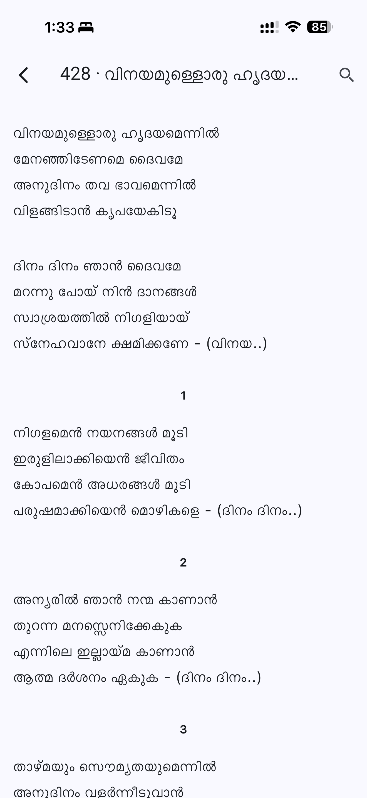
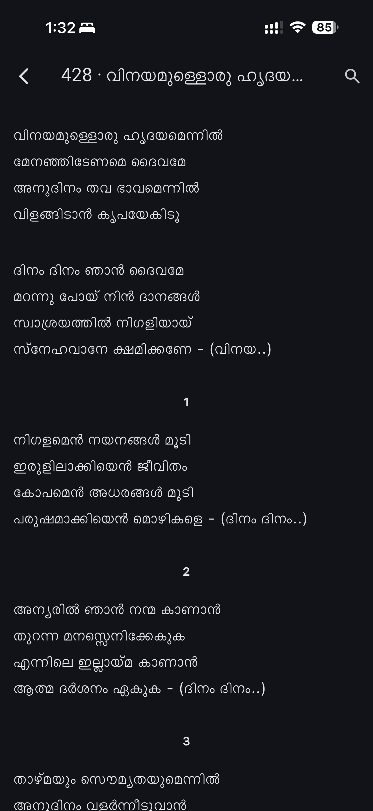
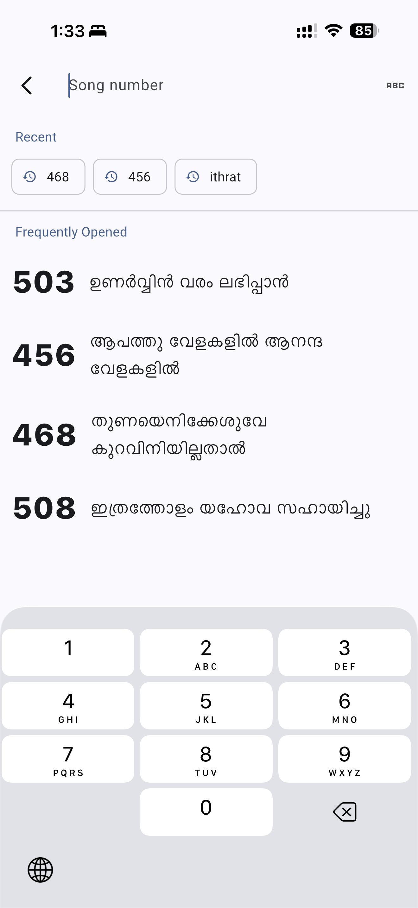
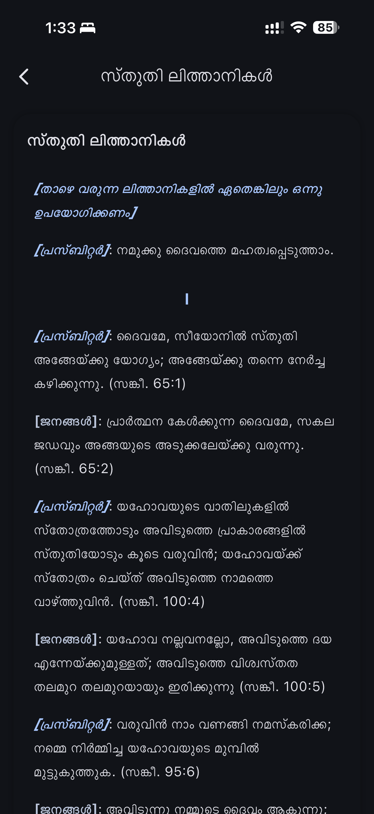
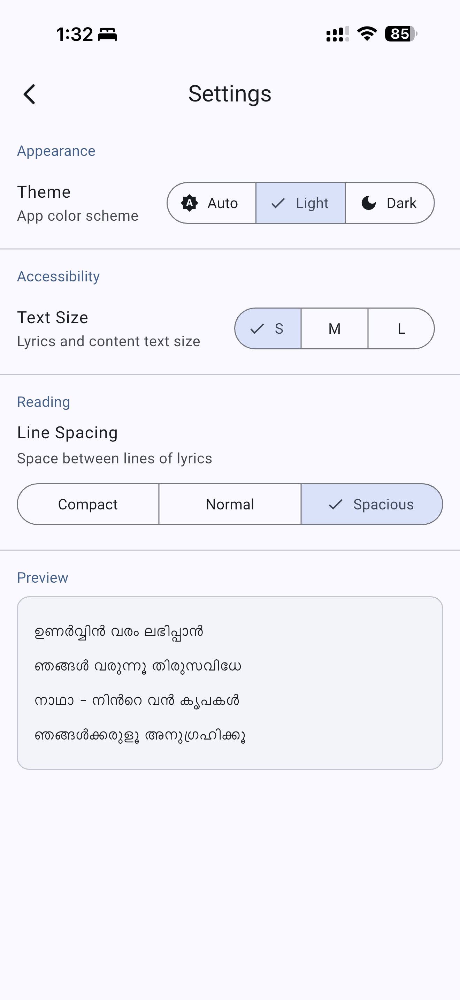

# Church of South India Songbook

A Malayalam Christian songbook app for the Church of South India, built with Flutter for Android and iOS.

## Screenshots

<table>
  <tr>
    <td align="center"><b>Song (Light)</b></td>
    <td align="center"><b>Song (Dark)</b></td>
    <td align="center"><b>Search</b></td>
    <td align="center"><b>Liturgy</b></td>
    <td align="center"><b>Settings</b></td>
  </tr>
  <tr>
    <td></td>
    <td></td>
    <td></td>
    <td></td>
    <td></td>
  </tr>
</table>

## Features

### Songs
- **550 Malayalam songs** (CSI hymnal) with LLM-structured HTML lyrics
- Lyrics rendered with semantic formatting — section headers (Pallavi, Anupallavi, Charanangal), centred verse numbers, and raaga/tala metadata in muted italic
- Swipe left/right to move between songs
- Screen stays on while reading lyrics (wakelock)

### Liturgy
- **44 liturgical sections** (ആരാധനാക്രമങ്ങൾ) including prayers, litanies, and orders of worship
- Priest/leader lines in primary-colour italic; congregation responses in bold
- Rubrics and stage directions rendered distinctly

### Search
- **Numpad by default** — type a 3-digit number to jump directly to that song
- Toggle to **title search** with the keyboard-switch button
- **Fuzzy Manglish matching** — phonetic normalization means `entho` and `ento`, `shalom` and `salom`, etc. all match the same songs
- **Direct Malayalam search** — type Malayalam script to match song titles
- **Recent searches** — last 3 queries shown as chips for one-tap re-run
- **Frequently opened** — songs you open most appear below recent searches

### Appearance & Accessibility
- **Material Design 3** throughout
- **Light / Dark / System** theme toggle — no white flash on launch in dark mode
- **Text size** — Small, Medium, Large
- **Line spacing** — Compact, Normal, Spacious
- **Live preview** in Settings updates instantly as you adjust size and spacing
- Draggable scrollbar on song and liturgy lists for fast navigation

## Tech Stack

| Layer | Technology |
|---|---|
| Framework | Flutter (Dart) |
| UI | Material Design 3 |
| State management | Provider |
| Database | SQLite (sqflite) — bundled read-only asset |
| Persistence | SharedPreferences (settings, search history) |
| Lyrics rendering | flutter_html |
| Lyrics generation | Google Gemma 3 27B via vLLM (offline pipeline) |

## Build & Run

```bash
# Install dependencies
flutter pub get

# Run on connected device / emulator
flutter run

# Build for Android
flutter build apk

# Build for iOS
flutter build ios

# Regenerate app icons (after changing assets/icons/app_icon.png)
dart run flutter_launcher_icons

# Regenerate native splash (after changing flutter_native_splash config in pubspec.yaml)
dart run flutter_native_splash:create

# Regenerate the SQLite databases (after updating song/liturgy source text)
python3.13 scripts/db/llm_songs_html.py
python3.13 scripts/db/llm_liturgy_html.py
python3.13 scripts/db/04_inject.py
```

## Related

- [Native Android version (older)](https://github.com/amaljoe/songbook_native_android)
